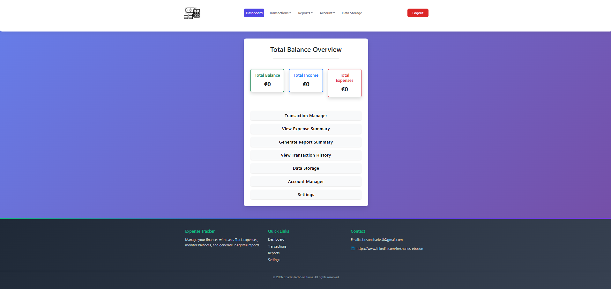

# Expense Tracker

A modern, full-stack expense tracking application built with React and Spring Boot. Track your finances, manage transactions, and generate insightful reports with an intuitive and responsive user interface.



## 🚀 Features

- **📊 Dashboard**: Real-time balance overview and financial insights
- **💳 Transaction Management**: Add, edit, delete, and filter transactions
- **📈 Expense Reports**: Categorized expense summaries and analytics
- **🔍 Advanced Filtering**: Filter transactions by date, amount, source, and category
- **📥📤 Data Import/Export**: Bulk import and export of transaction data
- **🔐 Secure Authentication**: JWT-based user authentication
- **📱 Responsive Design**: Works seamlessly on desktop and mobile devices
- **🎨 Modern UI**: Clean, modern interface with smooth animations

## 🛠️ Tech Stack

### Frontend
- **React 19** - Modern JavaScript library for building user interfaces
- **React Router** - Declarative routing for React
- **Bootstrap 5** - Responsive CSS framework
- **React Icons** - Popular icon library
- **Axios** - HTTP client for API requests

### Backend
- **Java 22** - Programming language
- **Spring Boot 3.3** - Framework for building Java applications
- **Spring Security** - Authentication and authorization
- **JWT** - JSON Web Tokens for secure authentication
- **MySQL/PostgreSQL** - Database options
- **Maven** - Dependency management and build tool

### Infrastructure
- **Docker** - Containerization
- **Docker Compose** - Multi-container orchestration

## 📋 Prerequisites

Before running this application, make sure you have the following installed:

- **Java 22** or higher
- **Node.js 18** or higher
- **Maven 3.6** or higher
- **Docker** and **Docker Compose** (for containerized deployment)
- **MySQL** or **PostgreSQL** database

## 🚀 Quick Start

### Using Docker Compose (Recommended)

1. **Clone the repository**
   ```bash
   git clone https://github.com/yourusername/expense-tracker.git
   cd expense-tracker
   ```

2. **Set up environment variables**
   ```bash
   cp .env.example .env
   # Edit .env with your database credentials
   ```

3. **Run with Docker Compose**
   ```bash
   docker-compose up -d
   ```

4. **Access the application**
   - Frontend: http://localhost:3000
   - Backend API: http://localhost:8080

### Manual Setup

#### Database Setup

1. **Install and start your database**
   - For MySQL: Install MySQL and create a database named `expense_tracker`
   - For PostgreSQL: Install PostgreSQL and create a database named `expense_tracker`

2. **Run the database schema**
   ```bash
   # For MySQL
   mysql -u yourusername -p expense_tracker < backend/sql_queries/mysql-queries.sql

   # For PostgreSQL
   psql -U yourusername -d expense_tracker -f backend/sql_queries/postgre-queries.sql
   ```

#### Backend Setup

1. **Navigate to backend directory**
   ```bash
   cd backend
   ```

2. **Configure environment variables**
   ```bash
   # Create application.properties or set environment variables
   export DB_URL=jdbc:mysql://localhost:3306/expense_tracker
   export DB_USER=your_db_user
   export DB_PASS=your_db_password
   ```

3. **Run the Spring Boot application**
   ```bash
   mvn spring-boot:run
   ```

#### Frontend Setup

1. **Navigate to frontend directory**
   ```bash
   cd frontend
   ```

2. **Install dependencies**
   ```bash
   npm install
   ```

3. **Start the development server**
   ```bash
   npm start
   ```

## 🔧 Configuration

### Environment Variables

Create a `.env` file in the root directory with the following variables:

```env
# Database Configuration
DB_ROOT_PASSWORD=rootpassword
DB_NAME=expense_tracker
DB_USER=expense_user
DB_PASS=expense_pass
DB_PORT=3306

# Application Configuration
JWT_SECRET=your-super-secret-jwt-key-change-this-in-production
BACKEND_PORT=8080
FRONTEND_PORT=3000
NGINX_PORT=80

# Frontend Configuration
REACT_APP_API_URL=http://localhost:8080

# Production Settings
NODE_ENV=production
```

### Database Configuration

The application supports both MySQL and PostgreSQL. Update the `DB_URL` in your environment variables:

**MySQL:**
```
DB_URL=jdbc:mysql://localhost:3306/expense_tracker?useSSL=false&allowPublicKeyRetrieval=true&serverTimezone=UTC
```

**PostgreSQL:**
```
DB_URL=jdbc:postgresql://localhost:5432/expense_tracker
```

## 🏗️ Building for Production

### Frontend Build

```bash
cd frontend
npm run build
```

This creates an optimized production build in the `build` folder.

### Backend Build

```bash
cd backend
mvn clean package -DskipTests
```

This creates a JAR file in the `target` folder.

### Docker Build

```bash
# Build all services
docker-compose build

# Or build individual services
docker build -t expense-tracker-backend ./backend
docker build -t expense-tracker-frontend ./frontend
```

## 🚀 Deployment

### Using Docker Compose

1. **Build and run**
   ```bash
   docker-compose up -d --build
   ```

2. **Scale services** (optional)
   ```bash
   docker-compose up -d --scale frontend=3
   ```

### Manual Deployment

1. **Deploy backend**
   ```bash
   java -jar backend/target/expense-tracker-1.0-SNAPSHOT.jar
   ```

2. **Serve frontend**
   ```bash
   # Using nginx
   cp -r frontend/build /var/www/html

   # Or using serve
   npx serve -s frontend/build -l 3000
   ```

## 🧪 Testing

### Backend Tests

```bash
cd backend
mvn test
```

### Frontend Tests

```bash
cd frontend
npm test
```

## 📁 Project Structure

```
expense-tracker/
├── backend/                 # Spring Boot application
│   ├── src/
│   │   ├── main/
│   │   │   ├── java/        # Java source files
│   │   │   └── resources/   # Application properties
│   │   └── test/            # Unit tests
│   ├── pom.xml              # Maven configuration
│   └── Dockerfile           # Backend Docker configuration
├── frontend/                # React application
│   ├── public/              # Static assets
│   ├── src/                 # React source files
│   │   ├── components/      # Reusable components
│   │   ├── pages/           # Page components
│   │   └── App.js           # Main App component
│   ├── package.json         # NPM configuration
│   └── Dockerfile           # Frontend Docker configuration
├── sql_queries/             # Database schema files
├── docker-compose.yml       # Docker Compose configuration
├── .env.example             # Environment variables template
└── README.md               # This file
```

## 🤝 Contributing

Contributions are welcome! Please follow these steps:

1. Fork the repository
2. Create a feature branch (`git checkout -b feature/amazing-feature`)
3. Commit your changes (`git commit -m 'Add amazing feature'`)
4. Push to the branch (`git push origin feature/amazing-feature`)
5. Open a Pull Request

### Development Guidelines

- Follow the existing code style
- Write tests for new features
- Update documentation as needed
- Ensure all tests pass before submitting

## 📝 API Documentation

### Authentication Endpoints

- `POST /api/auth/login` - User login
- `POST /api/auth/logout` - User logout
- `POST /api/auth/register` - User registration

### Transaction Endpoints

- `GET /api/transactions` - Get user transactions
- `POST /api/transactions` - Create new transaction
- `PUT /api/transactions/{id}` - Update transaction
- `DELETE /api/transactions/{id}` - Delete transaction

### Account Endpoints

- `GET /api/accounts/balance` - Get account balance
- `GET /api/accounts/summary` - Get expense summary

## 🐛 Troubleshooting

### Common Issues

1. **Database connection failed**
   - Check your database credentials in environment variables
   - Ensure the database is running and accessible

2. **Port already in use**
   - Change the port in application.properties or environment variables
   - Kill the process using the port: `lsof -ti:8080 | xargs kill`

3. **Frontend not loading**
   - Check if the backend is running on the correct port
   - Verify REACT_APP_API_URL in frontend environment

4. **Build failures**
   - Clear Maven cache: `mvn clean`
   - Clear npm cache: `npm cache clean --force`

## 📄 License

This project is licensed under the MIT License - see the [LICENSE](LICENSE) file for details.

## 👥 Authors

- **Charles Boson** - *Initial work* - [LinkedIn](https://linkedin.com/in/charlesboson)

## 🙏 Acknowledgments

- Thanks to the Spring Boot and React communities
- Icons provided by [React Icons](https://react-icons.github.io/react-icons/)
- UI components powered by [Bootstrap](https://getbootstrap.com/)

---

Made with ❤️ by CharlesTech Solutions